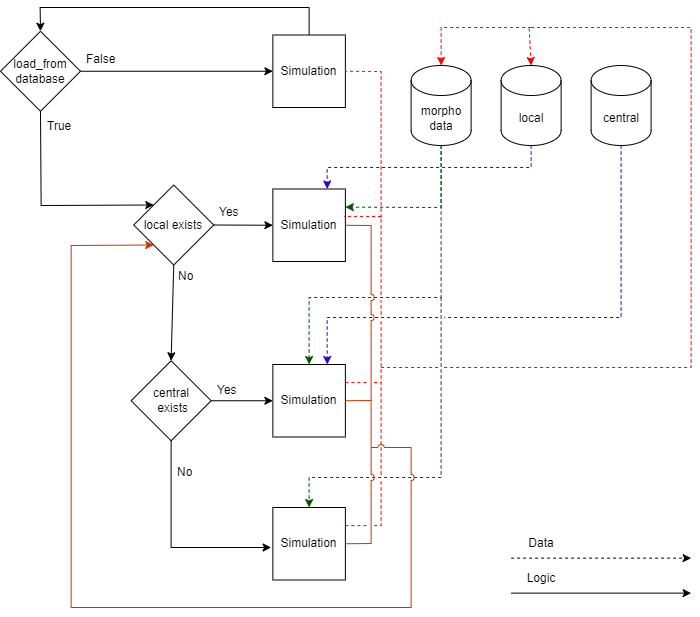

# Simulation Management Tool v2.0
The Simulation Management Tool (SMT) is a Python program for running 
- quasi steady hydrograph simulations 

## Background 

It was first developed in the context of the sustainable fairway in the Rhine [1], and provided a manner to run morphodynamic simulations using a quasi-steady approach using Delft3D 4. Within the context of the development of the new D-HYDRO - D-Flow Flexible Mesh software package and setup of the Maas model and 1D Maas and Rhine models, this functionality is upgraded to the new software version as well. 

## Installation

Install Anaconda (This can be downloaded from the Anaconda website [2]) or Miniconda [3]. See also the Anaconda docs for more information on environments [4]
Start an Anaconda command prompt from the Windows start menu, or activate the correct paths under linux. 

On the h7 linux cluster Anaconda can be activated using the following steps:

Load the anaconda3 module
 `module load anaconda3/miniconda`

Next activate conda
 `conda init`

Now should source the bash startup script again to really activate the conda environment
 `source ~/.bashrc`
If succesful, you should see (base) at the start of your prompt.

Next set a writable directory for your packages to be installed
 `conda config --add pkgs_dirs ~/.conda/pkgs/`
Next generate an environment with the following dependencies with the name `smt2_h7` - because your home folder used on the h6c7 is still accessible from h7, but the conda version is different.

 `conda create --name smt2_h7 python=3 mako pyyaml click pandas netCDF4`

<!--
To run the simulation use the start_h7.sh script

 `./start_h7.sh`  
Thats it - your model should now run.

Some of the example simulations require extra packages. To install these run the following commands: 
 `conda activate smt2`  
 `conda install geopandas`
 `conda install matplotlib`
--> 

## Running 
To run the SMT, first activate the `smt` environment
 `conda activate smt2_h7`

Then simply call runsim.py with a dedicated .yml file from the folder where the .yml lives
 `python src/runsim.py` 

```
Usage: runsim.py [OPTIONS]

Options:
  -v, --version        Print version information
  -s, --settings TEXT  SMT settings YAML file (default = smt.yml)
  -c, --clean          Indicates whether previous output should be cleaned
  --help               Show this message and exit.
```

<!-- A batch script is included which can be adapted to your preference - run_delft3d_smt.[bat/sh] to start your simulation --> 

## Program structure

```
Python files 
- application.py   - Application class 
- model.py         - Model preparation and adaptation
- runsim.py        - Main routine
- tools.py         - Various helper tools
- interpolation.py - Interpolation tools 

Other files 
- logging.conf   - Configuration file for logger 
```
## Example model file structure

```
- smt.yml                     - configuration file for the SMT
- static\                     - folder containing model input which is the same for all levels 
- dynamic\                    - folder containing model input which changed per level
+-- mdu_filename.mdu.template - mako template file for model input
- boundary_conditions\        - 
+-- bnd_filename.bc.template  - example template file for boundary conditions  
- central_database\           - initial restart information if available
- local_database\             - restart information updated during running the simulation
- output\                     - contains copies of work folder after completing the run
+-- work\                     - adapted source folder, used for running simulation
+-- 0\                        - first simulation output 
+-- ...                       - next simulation outputs

```

The figure below shows the workflow of the Simulation Management Tool. 




<!-- 
## Example simulations

In the examples folder you may find the following examples
- ex1    - quasi-steady-hydrograph hydrodynamic simulation 
- ex2    - quasi-steady-hydrograph morphodynamic simulation 
- ex3    - simulation-list hydrodynamic simulation for calibration 30 degree run Malone and Parr (2008) [3], requires SOBEK 3, and *gdal* library, sobek2dflowfmconverter [4]
- ex4    - simulation-list hydrodynamic simulation for all Malone and Parr (2008) cases [3], requires SOBEK 3, and *gdal* library, sobek2dflowfmconverter [4]
- ex5    - simulation-list hydrodynamic simulation for Blokland (1985) [5], upstream calibration, requires SOBEK 3, and *gdal* library, sobek2dflowfmconverter [4]
- ex6    - quasi-steady-hydrograph hydrodynamic simulation. Spinup to fill local database for 1D Maas model, Berends et al. (2020) [6], requires *geopandas* library for plotting functions
- ex7    - simulation-list grid convergence testing for Malone and Parr (2008) 
- ex12   - simulation-list hydrodynamic simulation for Blokland (1985) [5], straight channel solution, requires SOBEK 3, and *gdal* library, sobek2dflowfmconverter [4]
- ex13   - simulation-list hydrodynamic simulation for Blokland (1985) [5], curved channel solution, requires SOBEK 3, and *gdal* library, sobek2dflowfmconverter [4]
- ex14   - quasi-steady-hydrograph morphodynamic simulation for 1D Maas model, Berends et al. (2020) [6], requires *geopandas* library
- ex15   - quasi-steady-hydrograph morphodynamic simulation in parallel
- ex16   - quasi-steady-hydrograph morphodynamic 2D simulation sequential for Maas


<!--- ## Frequently asked questions ---> 

<!--
## Known Issues 
Unfortunately, sometimes some known issues may appear: 
- Delft3D-FM sometimes does not close off the process properly, locking the work folder for instance. To work around this, it may be necessary to restart your console window.
-->

<!--
## Troubleshooting 

1. Error about module not found 
```
>python ../../src/runsim.py
Traceback (most recent call last):
  File "../../src/runsim.py", line 2, in <module>
    import click
ModuleNotFoundError: No module named 'click'
```
* Check that your `smt2` environment is correctly loaded  
* If it is, try reinstalling the package 
--> 

## References

[1] Yossef, M. F. M., Jagers, H. R. A., Van Vuren, S., and Sieben, J. (2008). Innovative techniques in modelling large-scale river morphology, River Flow 2008 - Proc. Int. Conf. Fluvial Hydraulics, Çesme, Izmir, Turkey 1065-1074

[2] Anaconda (2020), Software package available from https://www.anaconda.com/products/individual

[3] Miniconda (2020), Lightweight Anaconda package available from https://docs.conda.io/en/latest/miniconda.html

[4] Anaconda (2020b), https://docs.conda.io/projects/conda/en/latest/user-guide/tasks/manage-environments.html#creating-an-environment-with-commands

<!--- at revision 16306 --->

<!---Van Vuren, B.G., Hauschild, A., Ottevanger, W., Crebas, J.I., Yossef M.F.M. (2008) Voorspelinstrument duurzame vaarweg: reducing computation time, Deltares (WL | Delft Hydraulics) Report

Yossef, M. F. M., Sloff, K. (2012). Detailed Modelling of River Morphological Response to Climate Change Scenarios, River Flow 2012 - International Conference on Fluvial Hydraulics, 845 - 853

Ottevanger, W., Giri, S. Sloff, C.J. (2015): Sustainable Fairway Rhinedelta II: Effects of yearly bed stabilisation nourishments, Delta Program measures and training walls. Deltares Project 1209175.

[3] Malone, T., and A. D. Parr (2008), Bend losses in rectangular culverts, Tech. Rep. K-TRAN: KU-05-5, Kansas Department of Transportation and Kansas State University.

[4] Mourits, A., Converter from SOBEK3 to D-Flow FM1D (available from: https://svn.oss.deltares.nl/repos/openearthtools/trunk/python/applications/delft3dfm/convert_to_dflowfm ) 

[5] Blokland, T. (1985), Turbulentiemetingen in een gekromde goot, Master Thesis R/1985/H/7, Delft University of Technology, Delft, the Netherlands, 340 pp.

[6] Berends, K., R. Daggenvoorde and K. Sloff (2020), Morphological models for IRM: Maas 1D. Deltares report 11203684-015-ZWS-0001. 

--->
